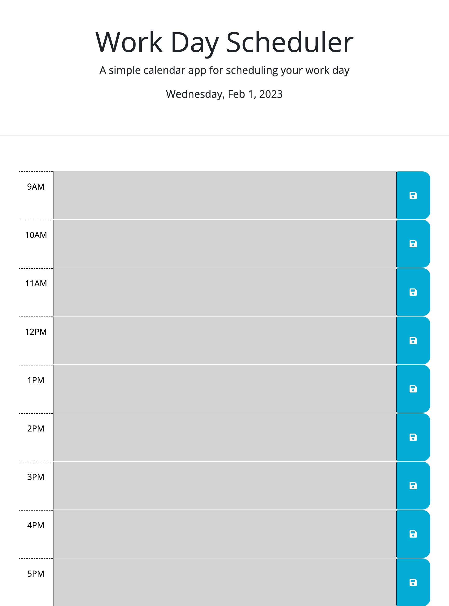

# Third-party-api-work-day-scheduler

## Description
This webpage's JavaScript code was incomplete and not working correctly. The input entered was not was not saving to local storage. New blocks were added for time in the day. New code that was written made it possible to your input to local storage. New code was written for a timer to appear when you save your input. The new code also includes a change of color for the time sections according to the times of day.

## Links

- [Live](https://tlequernaque.github.io/Third-party-api-work-day-scheduler/)

## Screenshots

## Available Commands

N/A

## Built With

- HTML
- CSS
- JavaScript

## Future Updates

- N/A

## Author

**Terry Lequernaque**

- [Email](mailto:t.lequernaque@yahoo.com?subject=Hi "Hi!")

## 🤝 Support

Contributions, issues, and feature requests are welcome!

Give a ⭐️ if you like this project!